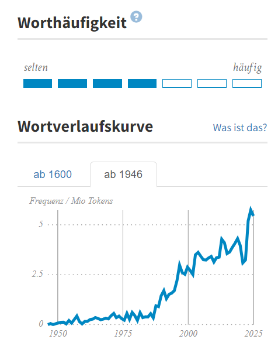
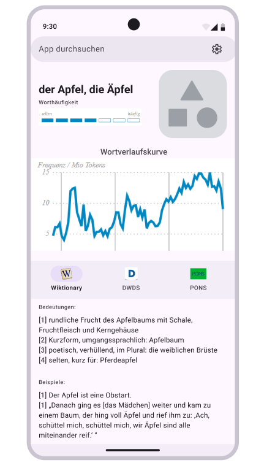

# Word search helper app

## Motivation

I want to create an app that helps boost the efficiency of learning foreign words.
For now, I will focus on making the app specific for somebody learning German, but in the 
future I will add settings parameters so that anybody can customize the app for any language. 

## Context

I have been learning German for a few years now and have to look up words regularly.
After I look up a word, I save it into my spaced-repetition learning app (called Anki) in the form of a two-sided card 
where one side has the word in German and a sample sentence in German, whereas the other side is the 
translation of the word and the sentence in English.

## Problem #1

Finding a sample sentence for a word that I am trying to learn is not always easy and can become time-consuming.
Why? Because I want that my sample sentence is:
- specific, in that it's easy to remember that a word is used in a very specific context.
- relatively short, 5-15 words is a good length range.
- relatively easy in terms of grammar and style.
- has a maximum of 1-2 other words that are new to me at the time of writing a card.
- memorable, in that the sentence is funny or epic sounding, so it can kind of stick in the head.
- etc. (_todo_)

For this reason, I have to visit multiple websites that have sample sentences from where 
I can choose one that I like the most according to the criteria listed above. The online resources that I found 
the most useful are:
- Wiktionary (one of my favorites)
- DWDS
- PONS
- Linguee (one of my favorites, but often it has way too generic sentences)
- Cambridge Dictionary
- ChatGPT (when I have a specific sentence in mind in English, I ask ChatGPT to translate in a way that it sounds idiomatic in German)
- News/magazine articles (one of my favorites, but sometimes I have to tweak the sentence to make it shorter or simpler)
- Duden

One can imagine that I spend long time to prepare one card which slows down my learning process.

## Problem #2

When I listen to a podcast, watch a video, a movie, or read a book and notice a new word, I need to figure out quickly whether
it's worth it for me to memorize this word and write a card for it. For example, I don't bother memorizing a word if it is:
- old/archaic,
- used in an extremely specific circumstance that rarely occurs,
- way too specific to a certain region outside which nobody uses this word,
- not frequently used in a modern day speech.

For now, the best tool that helps me figure out if I will go ahead with memorizing a word is a graph section of the DWDS
website showing the frequency of the word use with time:

## Solution

The best solution to solve these problems is to create a website displaying sample sentences
from all of my favorite resources in a user-friendly manner. Additionally, there should be 
a dedicated section where I can see the frequency of the word's use.

Initial Figma sketch:

